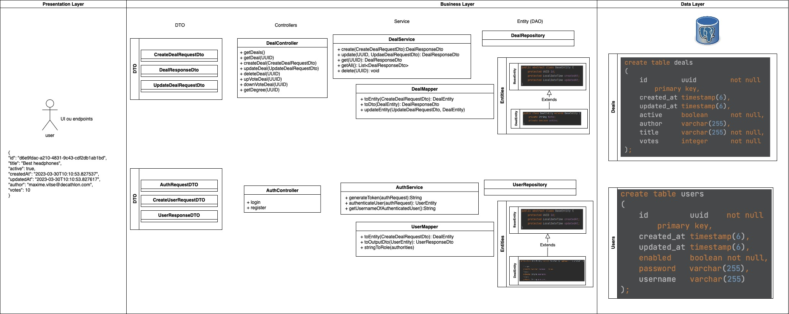
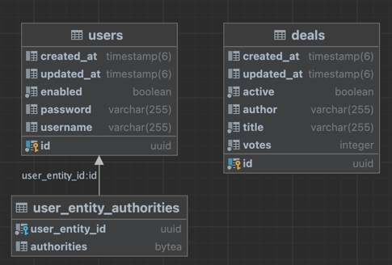

# Sujet

[SUJET.md](./SUJET.md)

# Setup

[💻 DEV.md](./DEV.md)

# DealHunter test

## Functional tests

### Requirements

- Database Running
- API Running
- NewMan installed (https://learning.postman.com/docs/running-collections/using-newman-cli/installing-running-newman/)

### Run

```bash
newman run src/test/functional/DealHunter_FunctionalTests.json
```

## Unit tests

> WIP

## Integration tests

> WIP

# Schema architecture N-Tiers



Lien vers l'architecture : [Dealhunter.drawio](https://app.diagrams.net/#G1JV7frwOrxJv80vo7KtEiK9-571BISpfK)

# Schema DB
